<h2 align="center">Evaluation of the Effects of Forest Patch Characteristics on Bird Abundance</h2>
<br>

### Aim

The aim of this study was to examine how forest fragmentation due to
land development affects bird abundance. Eight forest patch
characteristics were evaluated and added to a model to identify the main
determinants of forest bird abundance.

<br>

### Background

The dataset comprised observations from 56 independent forest patches.
Further information on variables is provided in the Statistical Methods
and Results section.

<br>

### Statistical Methods and Results

### Variables

1.  `Abundance` (abundance): the response variable measuring the average
    number of forest birds observed in a patch (counts from independent
    20-minute sessions).

2.  `Patch area` (patch.area): signifies size of the patch, measured in
    hectares (ha).

3.  `Year of isolation` (year.of.isolation): year the patch became
    isolated.

4.  `Distance to the nearest patch` (dist.nearest): distance to the next
    closest patch (km).

5.  `Distance to larger patch` (dist.larger): distance to the nearest
    larger patch (km).

6.  `Altitude` (altitude): represents patch elevation.

7.  `Grazing intensity` (grazing.intensity): is the study categorical
    variable suggesting how much the patch was grazed by livestock with
    five factor levels: light, less than average, average, moderately
    heavy, heavy.

8.  `Years of isolation` (yrs.isolation): number of years a patch has
    been fragmented.

<br>

### Methods and Results

Firstly, grazing levels were arranged from light to heavy. Data analysis
commenced with boxplot that provided insight into the relationship
between abundance and grazing.intensity (Figure 3). A scatterplot matrix
was created to visualise the pairwise relationships between abundance
and predictor variables, followed by a correlation analysis between
yrs.isolation and year.of.isolation (Figure 4). After this analysis the
preliminary model (Model 1) was proposed. Residual plots were examined
to ensure that assumptions of linear regression were met (Figure 5), and
potential outliers in Model 1 were assessed (Figure 6 and Table 1).
Model 2 was selected using a manual backward stepwise method (Figure
7-8), and then evaluated for its suitability as a linear model for
collected data (Figure 10). Lastly, a polynomial transformation was
added to the model and assessed, it was found not to be an appropriate
fit (Figure 11).

``` r
# Import data
d <- read.csv("forest.birds.csv", header = TRUE, stringsAsFactors = TRUE)

birds <- d

# Set grazing intensity factor levels from light to heavy
birds$grazing.intensity <- factor(
  birds$grazing.intensity,
  levels = c("light", "less than average", "average", "moderately heavy", "heavy")
)

birds$grazing.intensity <- relevel(birds$grazing.intensity, ref = "light")

# Check
levels(birds$grazing.intensity)
```

    [1] "light"             "less than average" "average"          
    [4] "moderately heavy"  "heavy"            

``` r
str(birds)
```

    'data.frame':   56 obs. of  8 variables:
     $ abundance        : num  5.3 2 1.5 17.1 13.8 14.1 3.8 2.2 3.3 3 ...
     $ patch.area       : num  0.1 0.5 0.5 1 1 1 1 1 1 1 ...
     $ year.of.isolation: int  1968 1920 1900 1966 1918 1965 1955 1920 1965 1900 ...
     $ dist.nearest     : int  39 234 104 66 246 234 467 284 156 311 ...
     $ dist.larger      : int  39 234 311 66 246 285 467 1829 156 571 ...
     $ grazing.intensity: Factor w/ 5 levels "light","less than average",..: 2 5 5 3 5 3 5 5 4 5 ...
     $ altitude         : int  160 60 140 160 140 130 90 60 130 130 ...
     $ yrs.isolation    : int  15 63 83 17 65 18 28 63 18 83 ...

``` r
head(birds)
```

      abundance patch.area year.of.isolation dist.nearest dist.larger
    1       5.3        0.1              1968           39          39
    2       2.0        0.5              1920          234         234
    3       1.5        0.5              1900          104         311
    4      17.1        1.0              1966           66          66
    5      13.8        1.0              1918          246         246
    6      14.1        1.0              1965          234         285
      grazing.intensity altitude yrs.isolation
    1 less than average      160            15
    2             heavy       60            63
    3             heavy      140            83
    4           average      160            17
    5             heavy      140            65
    6           average      130            18

``` r
summary(birds)
```

       abundance       patch.area      year.of.isolation  dist.nearest   
     Min.   : 1.50   Min.   :   0.10   Min.   :1890      Min.   :  26.0  
     1st Qu.:12.40   1st Qu.:   2.00   1st Qu.:1928      1st Qu.:  93.0  
     Median :21.05   Median :   7.50   Median :1962      Median : 234.0  
     Mean   :19.51   Mean   :  69.27   Mean   :1950      Mean   : 240.4  
     3rd Qu.:28.30   3rd Qu.:  29.75   3rd Qu.:1966      3rd Qu.: 333.2  
     Max.   :39.60   Max.   :1771.00   Max.   :1976      Max.   :1427.0  
      dist.larger             grazing.intensity    altitude     yrs.isolation  
     Min.   :  26.0   light            :13      Min.   : 60.0   Min.   : 7.00  
     1st Qu.: 158.2   less than average: 8      1st Qu.:120.0   1st Qu.:17.00  
     Median : 338.5   average          :15      Median :140.0   Median :20.50  
     Mean   : 733.3   moderately heavy : 7      Mean   :146.2   Mean   :33.25  
     3rd Qu.: 913.8   heavy            :13      3rd Qu.:182.5   3rd Qu.:55.50  
     Max.   :4426.0                             Max.   :260.0   Max.   :93.00  

<br>

### Descriptive Statistics and Data Visualisation

``` r
# Boxplot
boxplot(abundance ~ grazing.intensity, data = birds,
        main = "bird numbers vs grazing parctices",
        xlab = "")
```

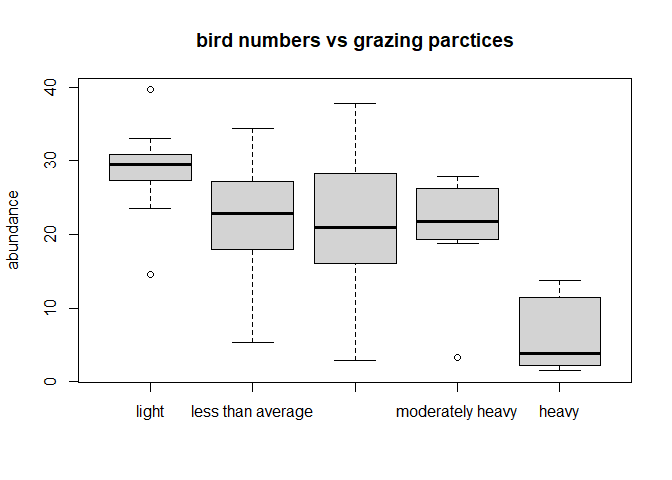

**Figure 3** *Relationship Between Abundance of Birds and Five Levels of
Grazing*

The box plot suggested that heavy grazing practices were associated with
fewer bird numbers than the other four grazing intensities. Also,
outliers were observed with the moderately heavy and light grazing
levels.

``` r
pairs(birds[, c("abundance","patch.area","year.of.isolation",
                "dist.nearest","dist.larger","altitude","yrs.isolation")],
  panel = panel.smooth
)
```

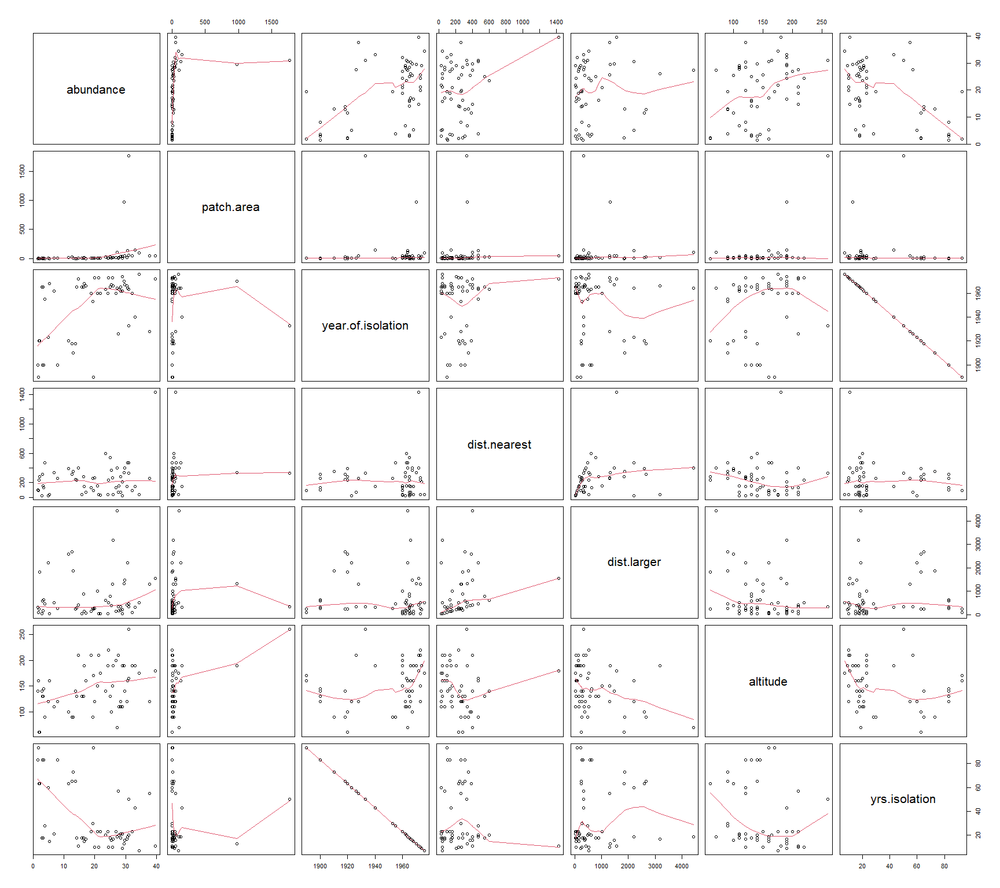

**Figure 4** *Scatterplot Matrix for Abundance and Predictor Variables*

Based on the inspection it was not clear if there were strong
relationships between the abundance of birds and explanatory variables.
For instance, the patch.area against abundance plot showed most of the
data points concentrated around small patch sizes. Similarly, this
pattern appeared between abundance and dist.nearest, dist.larger and
yrs.isolation, suggesting a need for log transformations of these
predictors. The relationship between the response variable and altitude
seemed linear but not overly strong. Contrastingly, yrs.isolation and
year.of.isolation seemed strongly correlated, which indicated the need
to remove one of these variables from the model to avoid
multicollinearity.

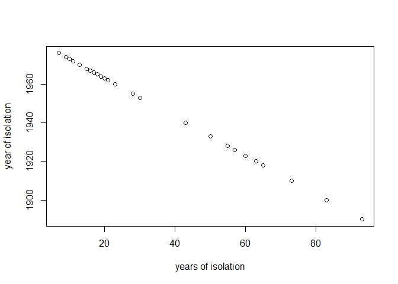

**Figure 4 (cont.)** *Relationship Between yrs.isolation and
year.of.isolation*

A correlation test (*r* = -1, *p* \< .001) confirmed that yrs.isolation
and year.of.isolation were highly corelated. To avoid multicollinearity,
year.of.isolation was excluded from the model, while yrs.isolation was
kept due to its interpretability. Prompted by the pairwise scatterplot
A, four log transformations were applied to patch.area, dist.nearest,
dist.larger, yrs.isolation, and the transformed predictors were added to
the preliminary linear model. Also, interaction terms were added to
evaluate the effect of altitude on abundance across different grazing
levels (altitude:grazing.intensity), and whether the effects of
patch.size on abundance differed across grazing intensities
(log(patch.area):grazing.intensity). As a result, the preliminary model
was:

Model 1: abundance ~ log(patch.area) + log(dist.nearest) +
log(dist.larger) + altitude + grazing.intensity + log(yrs.isolation) +
log(patch.area):grazing.intensity + altitude:grazing.intensity

``` r
# Fit preliminary model (Model 1)
prelim <- lm(abundance ~ log(patch.area) + log(dist.nearest) + log(dist.larger) +
               altitude + grazing.intensity + log(yrs.isolation) +
               log(patch.area):grazing.intensity + altitude:grazing.intensity,
             data = birds)
# summary(prelim), run if call needed 
```

To evaluate the regression line of the new model, an inspection of the
diagnostic plot of residuals for Model 1 was preformed (Figure K).

``` r
opar <- par(mfrow = c(2, 2))
plot(prelim)
```

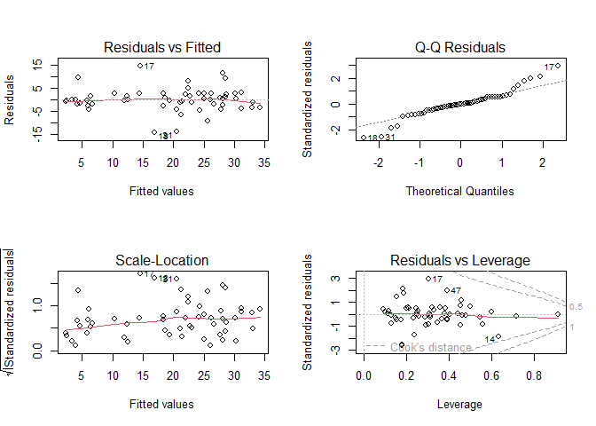

``` r
par(opar)
```

**Figure 5** *Residual Diagnostic Plots for the Preliminary Regression
Model*

The Residuals vs. Fitted plot suggested that a linear regression may
adequately capture the relationship between the variables. The
Scale-Location plot indicated slight non-constant variance
(heteroscedasticity), with gentle fanning out. The Q-Q plot showed a
S-shape pattern, suggesting a heavy tailed distribution. The Residuals
vs Leverage plot highlighted that 17 and 47 might be outliers while 14
had high leverage.

Further checks were done on cases 14, 17, and 47. Case 17 showed high
DFBETA values for the intercept and several predictors, indicating a
high influence on coefficient if removed. Case 14 also showed similar
values while case 47 did not return any noteworthy results. Both cased
14 and 17 demonstrated high DIFFTS values in comparison to all other
cases, which suggested their strong effect on fitted values if removed.
Residual plots inspection and coefficients of Model 1 without cases 14
and 17.

``` r
# Check influence measures
#summary(influence.measures(prelim)), print if needed
```

``` r
birds[c(14, 17, 47), ]
```

       abundance patch.area year.of.isolation dist.nearest dist.larger
    14      14.6          2              1972          402         402
    17      29.0          3              1962           26          26
    47      37.7         48              1928          259        1297
       grazing.intensity altitude yrs.isolation
    14             light      210            11
    17           average      110            21
    47           average      120            55

``` r
fit0_no17 <- lm(abundance ~ log(patch.area) + log(dist.nearest) + log(dist.larger) +
                  grazing.intensity + altitude + yrs.isolation +
                  patch.area:grazing.intensity + altitude:grazing.intensity,
                data = birds[-c(17), ])
#summary(fit0_no17)
opar <- par(mfrow = c(2, 2))
plot(fit0_no17)
```

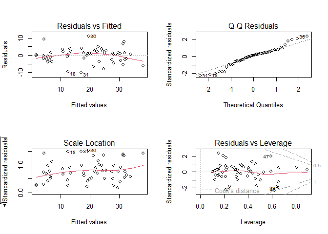

``` r
par(opar)
```

``` r
fit0_no14 <- lm(abundance ~ log(patch.area) + log(dist.nearest) + log(dist.larger) +
                  grazing.intensity + altitude + yrs.isolation +
                  patch.area:grazing.intensity + altitude:grazing.intensity,
                data = birds[-c(14), ])
#summary(fit0_no14)
opar <- par(mfrow = c(2, 2))
plot(fit0_no14)
```

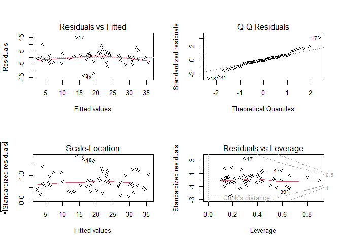

``` r
par(opar)
```

``` r
fit0_no_14.17 <- lm(abundance ~ log(patch.area) + log(dist.nearest) + log(dist.larger) +
                      grazing.intensity + altitude + yrs.isolation +
                      patch.area:grazing.intensity + altitude:grazing.intensity,
                    data = birds[-c(14, 17), ])
#summary(fit0_no_14.17)
opar <- par(mfrow = c(2, 2))
plot(fit0_no_14.17)
```

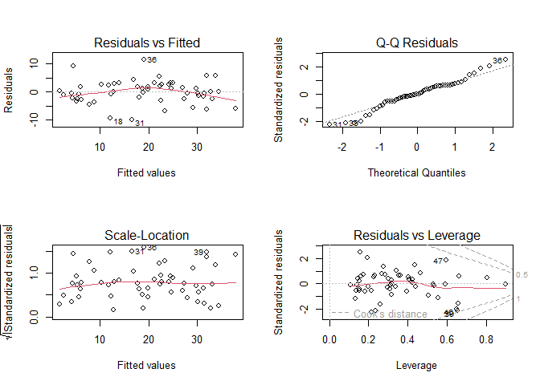

``` r
par(opar)
```

**Figure 6** *Residual Diagnostic Plots for Model 1 Cases 14 and 17*

The Residuals vs. Fitted plot suggested that a linear regression may not
capture the relationship between the variables. The Scale-Location plot
indicated homoscedasticity. The Q-Q plot showed a S-shape pattern,
suggesting a heavy tailed bell curve. The Residuals vs Leverage plot
highlighted that three data points (39, 46 and 47) might display high
leverage.

**Table 1** *Summary of Adjusted R<sup>2</sup> and Signifincat
Coefficinets With and Without Cases 14 and 17*

|  | *All cases included* | *no 17* | *no 14* | *no 14 and 17* |
|----|----|----|----|----|
| Adjusted R<sup>2</sup> | 69% | 77% | 72% | 79% |
| log(patch.area)<sup>a</sup> | ns | 2.93\*\* | ns | 2.04\* |
| average | -22.06\* | -23.75\* | ns | -20.89\* |
| heavy | -20.32\* | ns | ns | ns |
| average:altitude<sup>a</sup> | ns | 0.15\* | ns | ns |
| grazing.average:patch.area<sup>a</sup> | ns | ns | ns | -0.26\* |
| log(patch.area):moderately heavy<sup>a</sup> | 6.7\* | ns | ns | ns |
| moderately heavy:patch.area<sup>a</sup> | ns | ns | 0.92\* | 0.89\* |

Note. \* *p* \< .05, \*\* *p* \< .01, \*\*\* *p* \< .001., ns = not
significant at α = .05., <sup>a</sup> Coefficients that were
statisrically significant based on the preliminary model and its case
combinations.

The analysis in Table 1 demonstrated that removal of the two cases
increased the explained variation by 10% compared to the all-inclusive
model. Also, it showed an increase in number of significant
coefficients. While the residual plot (Figure 6) shows improvement in
the constant variance, linearity worsened and three new outliers
appeared. Given that removing case 14 and 17 did not resolve the initial
concerns it was decided to keep all data points. As a result, Model 1
was accepted and stepwise approach was used until all statistically
significant predictors were selected.

``` r
d1 <- lm(abundance ~ log(patch.area) + log(dist.nearest) + log(dist.larger) +
           altitude + grazing.intensity + log(yrs.isolation) +
           log(patch.area):grazing.intensity + altitude:grazing.intensity,
         data = birds)
drop1(d1, .~., test = "F")
```

    Single term deletions

    Model:
    abundance ~ log(patch.area) + log(dist.nearest) + log(dist.larger) + 
        altitude + grazing.intensity + log(yrs.isolation) + log(patch.area):grazing.intensity + 
        altitude:grazing.intensity
                                      Df Sum of Sq    RSS    AIC F value  Pr(>F)  
    <none>                                         1350.5 214.24                  
    log(patch.area)                    1   104.068 1454.5 216.40  2.9283 0.09519 .
    log(dist.nearest)                  1     5.096 1355.6 212.45  0.1434 0.70703  
    log(dist.larger)                   1     0.230 1350.7 212.25  0.0065 0.93624  
    altitude                           1     6.277 1356.8 212.50  0.1766 0.67666  
    grazing.intensity                  4   247.853 1598.3 215.68  1.7435 0.16062  
    log(yrs.isolation)                 1     5.603 1356.1 212.47  0.1577 0.69355  
    log(patch.area):grazing.intensity  4   235.964 1586.4 215.26  1.6599 0.17945  
    altitude:grazing.intensity         4    97.219 1447.7 210.13  0.6839 0.60750  
    ---
    Signif. codes:  0 '***' 0.001 '**' 0.01 '*' 0.05 '.' 0.1 ' ' 1

**Figure 7** *First Step in Model Construction using the Drop Function*

The first step in predictor selection is shown in Figure 7. The output
indicated that log(dist.larger) was least helpful with a p = 0.94,
therefore it was removed from the model. This process was repeated, and
predictors were removed in the following order: log(dist.nearest) (p =
0.70), log(yrs.isolation) (p = 0.71), altitude (p = 0.70),
grazing.intensity:altitude (p = 0.63), log(patch.area):grazing.intensity
(p = 0.11).

``` r
d2 <- lm(abundance ~ log(patch.area) + log(dist.nearest) + altitude +
           grazing.intensity + log(yrs.isolation) +
           log(patch.area):grazing.intensity + altitude:grazing.intensity,
         data = birds)
drop1(d2, .~., test = "F")
```

    Single term deletions

    Model:
    abundance ~ log(patch.area) + log(dist.nearest) + altitude + 
        grazing.intensity + log(yrs.isolation) + log(patch.area):grazing.intensity + 
        altitude:grazing.intensity
                                      Df Sum of Sq    RSS    AIC F value  Pr(>F)  
    <none>                                         1350.7 212.25                  
    log(patch.area)                    1   106.914 1457.6 214.52  3.0870 0.08677 .
    log(dist.nearest)                  1     5.454 1356.2 210.48  0.1575 0.69364  
    altitude                           1     6.137 1356.8 210.50  0.1772 0.67610  
    grazing.intensity                  4   250.029 1600.7 213.76  1.8048 0.14747  
    log(yrs.isolation)                 1     5.477 1356.2 210.48  0.1581 0.69305  
    log(patch.area):grazing.intensity  4   235.939 1586.7 213.27  1.7031 0.16889  
    altitude:grazing.intensity         4    99.797 1450.5 208.24  0.7204 0.58323  
    ---
    Signif. codes:  0 '***' 0.001 '**' 0.01 '*' 0.05 '.' 0.1 ' ' 1

``` r
d3 <- lm(abundance ~ log(patch.area) + altitude + grazing.intensity +
           log(yrs.isolation) + log(patch.area):grazing.intensity +
           altitude:grazing.intensity,
         data = birds)
drop1(d3, .~., test = "F")
```

    Single term deletions

    Model:
    abundance ~ log(patch.area) + altitude + grazing.intensity + 
        log(yrs.isolation) + log(patch.area):grazing.intensity + 
        altitude:grazing.intensity
                                      Df Sum of Sq    RSS    AIC F value  Pr(>F)  
    <none>                                         1356.2 210.48                  
    log(patch.area)                    1   105.954 1462.1 212.69  3.1251 0.08472 .
    altitude                           1     5.489 1361.7 208.70  0.1619 0.68955  
    grazing.intensity                  4   247.250 1603.4 211.85  1.8232 0.14336  
    log(yrs.isolation)                 1     4.753 1360.9 208.67  0.1402 0.71006  
    log(patch.area):grazing.intensity  4   245.868 1602.0 211.81  1.8130 0.14533  
    altitude:grazing.intensity         4    95.645 1451.8 206.29  0.7053 0.59305  
    ---
    Signif. codes:  0 '***' 0.001 '**' 0.01 '*' 0.05 '.' 0.1 ' ' 1

``` r
d4 <- lm(abundance ~ log(patch.area) + altitude + grazing.intensity +
           log(patch.area):grazing.intensity + altitude:grazing.intensity,
         data = birds)
drop1(d4, .~., test = "F")
```

    Single term deletions

    Model:
    abundance ~ log(patch.area) + altitude + grazing.intensity + 
        log(patch.area):grazing.intensity + altitude:grazing.intensity
                                      Df Sum of Sq    RSS    AIC F value Pr(>F)  
    <none>                                         1360.9 208.67                 
    log(patch.area)                    1   131.666 1492.6 211.84  3.9667 0.0531 .
    altitude                           1     5.296 1366.2 206.89  0.1595 0.6917  
    grazing.intensity                  4   242.547 1603.5 209.86  1.8268 0.1421  
    log(patch.area):grazing.intensity  4   242.131 1603.0 209.84  1.8237 0.1427  
    altitude:grazing.intensity         4   102.101 1463.0 204.72  0.7690 0.5516  
    ---
    Signif. codes:  0 '***' 0.001 '**' 0.01 '*' 0.05 '.' 0.1 ' ' 1

``` r
d5 <- lm(abundance ~ log(patch.area) + grazing.intensity +
           log(patch.area):grazing.intensity + altitude:grazing.intensity,
         data = birds)
drop1(d5, .~., test = "F")
```

    Single term deletions

    Model:
    abundance ~ log(patch.area) + grazing.intensity + log(patch.area):grazing.intensity + 
        altitude:grazing.intensity
                                      Df Sum of Sq    RSS    AIC F value Pr(>F)  
    <none>                                         1360.9 208.67                 
    log(patch.area)                    1    131.67 1492.6 211.84  3.9667 0.0531 .
    grazing.intensity                  4    242.55 1603.5 209.86  1.8268 0.1421  
    log(patch.area):grazing.intensity  4    242.13 1603.0 209.84  1.8237 0.1427  
    grazing.intensity:altitude         5    115.71 1476.6 203.24  0.6972 0.6286  
    ---
    Signif. codes:  0 '***' 0.001 '**' 0.01 '*' 0.05 '.' 0.1 ' ' 1

``` r
d6 <- lm(abundance ~ log(patch.area) + grazing.intensity +
           log(patch.area):grazing.intensity,
         data = birds)
drop1(d6, .~., test = "F")
```

    Single term deletions

    Model:
    abundance ~ log(patch.area) + grazing.intensity + log(patch.area):grazing.intensity
                                      Df Sum of Sq    RSS    AIC F value    Pr(>F)
    <none>                                         1476.6 203.24                  
    log(patch.area)                    1    130.25 1606.9 205.97  4.0576 0.0498425
    grazing.intensity                  4    791.29 2267.9 219.27  6.1626 0.0004669
    log(patch.area):grazing.intensity  4    253.77 1730.4 204.12  1.9764 0.1139348
                                         
    <none>                               
    log(patch.area)                   *  
    grazing.intensity                 ***
    log(patch.area):grazing.intensity    
    ---
    Signif. codes:  0 '***' 0.001 '**' 0.01 '*' 0.05 '.' 0.1 ' ' 1

``` r
d7 <- lm(abundance ~ log(patch.area) + grazing.intensity, data = birds)
drop1(d7, .~., test = "F")
```

    Single term deletions

    Model:
    abundance ~ log(patch.area) + grazing.intensity
                      Df Sum of Sq    RSS    AIC F value    Pr(>F)    
    <none>                         1730.4 204.12                      
    log(patch.area)    1    1153.8 2884.2 230.73 33.3405 4.901e-07 ***
    grazing.intensity  4    1136.5 2866.9 224.40  8.2101 3.598e-05 ***
    ---
    Signif. codes:  0 '***' 0.001 '**' 0.01 '*' 0.05 '.' 0.1 ' ' 1

**Figure 8** *Final Step in Model Construction using the Drop Function*

The resulting model demonstrated an AIC decrease for the two remaining
predictors.

``` r
fit_final <- lm(abundance ~ log(patch.area) + grazing.intensity, data = birds)
summary(fit_final)
```


    Call:
    lm(formula = abundance ~ log(patch.area) + grazing.intensity, 
        data = birds)

    Residuals:
         Min       1Q   Median       3Q      Max 
    -16.0849  -2.4793  -0.0817   2.6486  11.6344 

    Coefficients:
                                       Estimate Std. Error t value Pr(>|t|)    
    (Intercept)                         15.7164     2.7674   5.679 6.87e-07 ***
    log(patch.area)                      3.1474     0.5451   5.774 4.90e-07 ***
    grazing.intensityless than average   0.3826     2.9123   0.131 0.895993    
    grazing.intensityaverage            -0.1893     2.5498  -0.074 0.941119    
    grazing.intensitymoderately heavy   -1.5916     2.9762  -0.535 0.595182    
    grazing.intensityheavy             -11.8938     2.9311  -4.058 0.000174 ***
    ---
    Signif. codes:  0 '***' 0.001 '**' 0.01 '*' 0.05 '.' 0.1 ' ' 1

    Residual standard error: 5.883 on 50 degrees of freedom
    Multiple R-squared:  0.727, Adjusted R-squared:  0.6997 
    F-statistic: 26.63 on 5 and 50 DF,  p-value: 5.148e-13

**Figure 9** *Characteristics of Model 2*

Model 2 included log(patch.area) and grazing intensity (heavy). The
regression summary suggested that the patch area was a significant and
positive predictor of abundance. This meant a unit increase in
log(patch.area) was associated with an increase in 3.1 birds while
holding grazing constant. Contrastingly, heavy grazing practices were
associated with 11 fewer birds than areas with light grazing practices,
controlling for abundance. The model explained 70% of variation in bird
abundance (adjusted R²).

``` r
opar <- par(mfrow = c(2, 2))
plot(fit_final)
```

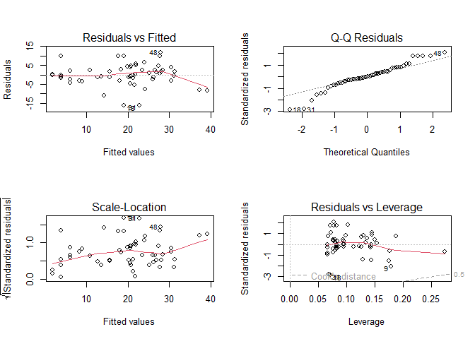

``` r
par(opar)
```

**Figure 10** *Model 2 Residual Diagnostic Plots*

The diagnostic plots demonstrated a change for the Residuals vs. Fitted
and Scale-Location plot in comparison to Model 1. It suggested a
decreased ability of a linear model to capture the relationship between
variables, and an increase in heteroskedasticity. Therefore, a
polynomial transformation of patch area was tested.

On inspection, Model 3 (labelled Model 2 below) which included a
quadratic term did not significantly (p = 0.73) contribute to explaining
bird abundance in segmented patches of forest as demonstrated below:

``` r
poly <- lm(abundance ~ log(patch.area) + I(log(patch.area)^2) + grazing.intensity,
           data = birds)

opar <- par(mfrow = c(2, 2))
plot(poly)
```

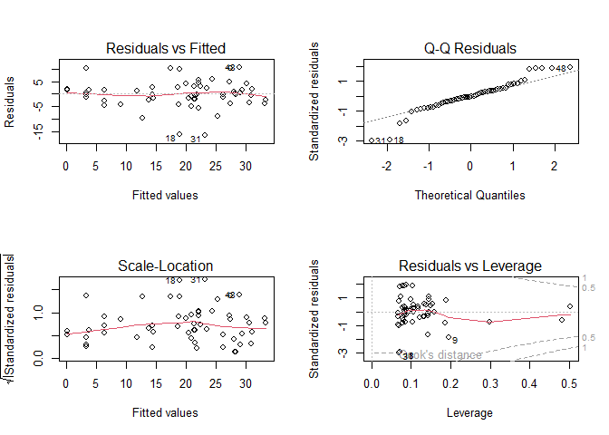

``` r
par(opar)
```

**Figure 11** *Model 3 Residual Diagnostic Plots With a Polynomial
Transformation*

Adding a polynomial term for log(patch.area) slightly improved the
residual plots in comparison to the plot in Figure 10. In particular,
there was an improvement in the Residuals vs. Fitted plot demonstrated
as a reduction in the bend.

``` r
summary(poly)
```


    Call:
    lm(formula = abundance ~ log(patch.area) + I(log(patch.area)^2) + 
        grazing.intensity, data = birds)

    Residuals:
         Min       1Q   Median       3Q      Max 
    -16.4488  -2.3501  -0.1569   2.5526  10.5411 

    Coefficients:
                                       Estimate Std. Error t value Pr(>|t|)    
    (Intercept)                         15.9102     2.7065   5.879 3.60e-07 ***
    log(patch.area)                      4.5033     0.9118   4.939 9.54e-06 ***
    I(log(patch.area)^2)                -0.2890     0.1577  -1.832    0.073 .  
    grazing.intensityless than average  -0.2003     2.8637  -0.070    0.945    
    grazing.intensityaverage            -1.4983     2.5922  -0.578    0.566    
    grazing.intensitymoderately heavy   -3.1225     3.0261  -1.032    0.307    
    grazing.intensityheavy             -12.5573     2.8872  -4.349 6.90e-05 ***
    ---
    Signif. codes:  0 '***' 0.001 '**' 0.01 '*' 0.05 '.' 0.1 ' ' 1

    Residual standard error: 5.749 on 49 degrees of freedom
    Multiple R-squared:  0.7445,    Adjusted R-squared:  0.7132 
    F-statistic: 23.79 on 6 and 49 DF,  p-value: 5.834e-13

**Figure 12** *Characteristics of Model 3 with Quadratic Addition*

Model 3 included a quadratic term for log(patch.area) and grazing
intensity (heavy). The model indicated that log(patch.area) was a
significant predictor of abundance while the quadratic term wasn’t. In
contrast to Model 2, heavy grazing practices were significant and
associated with 12.5 fewer birds than areas with light grazing
practices, controlling for abundance. The model explained 71% of
variation in bird abundance (adjusted R²).

``` r
anova(fit_final, poly)
```

    Analysis of Variance Table

    Model 1: abundance ~ log(patch.area) + grazing.intensity
    Model 2: abundance ~ log(patch.area) + I(log(patch.area)^2) + grazing.intensity
      Res.Df    RSS Df Sum of Sq      F  Pr(>F)  
    1     50 1730.4                              
    2     49 1619.5  1    110.94 3.3568 0.07301 .
    ---
    Signif. codes:  0 '***' 0.001 '**' 0.01 '*' 0.05 '.' 0.1 ' ' 1

``` r
AIC(fit_final, poly)
```

              df      AIC
    fit_final  7 365.0434
    poly       8 363.3327

It seemed that the quadratic term reduced the curvature (Figure 11).
However, the quadratic term coefficient in the updated model (Model 3)
was not significant. Therefore, to keep the model simple and based on
the observations above, the quadratic term was excluded. The final
model, and thus, determinants of bird abundance were log(patch.area) and
grazing.intensity:

<div style="text-align: center;">

<h3>
::: {style="text-align: center;"}
Final Model (Model 2): abundance ~ log(patch.area) + grazing.intensity
</h3>
:::

</div>

<br>

### Data Visualisation (Power Relationship and Parallel Regression Lines)

``` r
# Abundance vs patch area (ha) with CI and PI
fit_short <- lm(abundance ~ log(patch.area), data = birds)

plot(abundance ~ patch.area, data = birds,
     xlab = "patch area (ha)", ylab = "Abundance",
     pch = 16, xlim = c(0, 100))

xmin <- max(min(birds$patch.area, na.rm = TRUE), 1e-6)
newx <- seq(xmin, 200, length.out = 400)

pr.conf <- predict(fit_short, newdata = data.frame(patch.area = newx), interval = "confidence")
matlines(newx, pr.conf, col = c("black", "red", "red"), lty = c(1))

pr.pred <- predict(fit_short, newdata = data.frame(patch.area = newx), interval = "prediction")
matlines(newx, pr.pred, col = c("black", "red", "red"), lty = c(2))
```

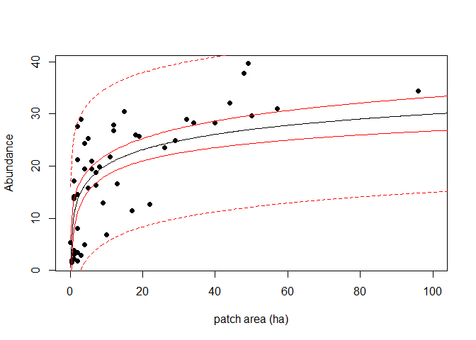

**Figure 1** *Relationship Between Bird Abundance and Patch Area (ha)*

``` r
# Parallel lines: light vs heavy grazing
with(birds, {
  plot(log(patch.area), abundance,
       pch = 16, col = "gray",
       xlab = "log(patch.area)", ylab = "Abundance",
       xlim = c(0, max(log(patch.area), na.rm = TRUE)))

  points(log(patch.area)[grazing.intensity == "light"],
         abundance[grazing.intensity == "light"],
         pch = 16, col = "red")

  points(log(patch.area)[grazing.intensity == "heavy"],
         abundance[grazing.intensity == "heavy"],
         pch = 16, col = "black")
})

abline(a = coef(fit_final)[1],
       b = coef(fit_final)[2], col = "red")
abline(a = coef(fit_final)[1] + coef(fit_final)[6],
       b = coef(fit_final)[2], col = "black")

legend("topleft",
       legend = c("Light grazing", "Heavy grazing"),
       col = c("red", "black"),
       pch = 16, lty = 1, lwd = 2,
       bty = "n")
```

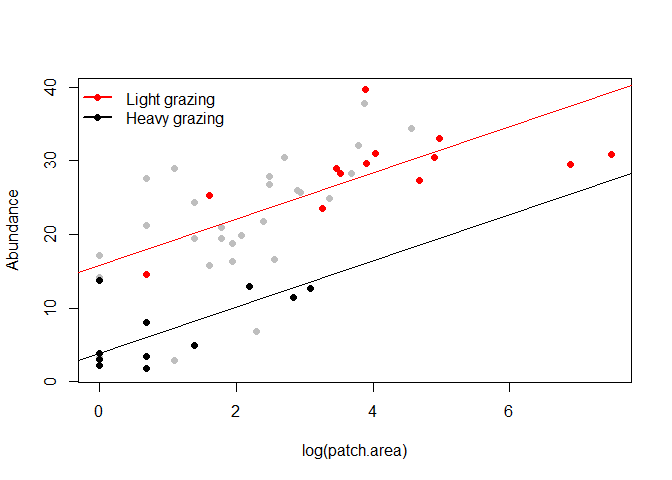

**Figure 2** *Parallel Regression Lines for Light and Heavy Grazing
Intensity Across Log(Patch Area)*

<br>

### Findings

1.  The analysis showed that the relationship between patch size and
    bird abundance was positive: larger patches held larger bird
    numbers.

2.  The relationship between light and heavy grazing practices can be
    explained by a parallel linear relationship.

<br>

### Discussion

The final model (Table GG) suggested that patch.area and
grazing.intensity explained 70% of the variance in bird abundance.
Specifically, if a patch size were to double, there would be an increase
of about 2.2 birds (calculated as b X ln(2)). Model 2 also implied that,
in this dataset, patches with heavy grazing practices contained an
average of 3.8 birds while lightly grazed patches contained about 15.5
birds, holding patch size constant (E\[Abundance \| log(patch.area),
light grazing\] = 15.72 + 3.15log(patch.area); E\[Abundance \|
log(patch.area), heavy grazing\] = 3.82 + 3.15log(patch.area)).

Residual plots suggested slight non-linearity (Table pp), thus, using
Model 2 to predict bird abundance should be interpreted with caution.
Considering the linearity concerns, future studies could apply
statistical techniques that are more robust to large variability and
skewed distributions. It might be important investigate why only light
and heavy grazing intensities were significantly different, as this may
signal that unidentified predictors mediate the relationship between
grazing intensities and bird abundance (supports by the unexplained
leftover 30% variance). Lastly, the results may have practical
implications land developers: increase patch sizes and reduce grazing
practices to boost bird numbers (Figure 1-2).

<br> <br>
