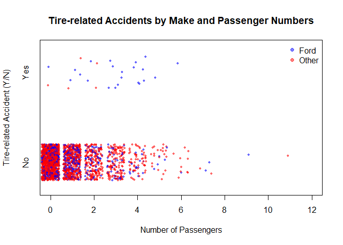
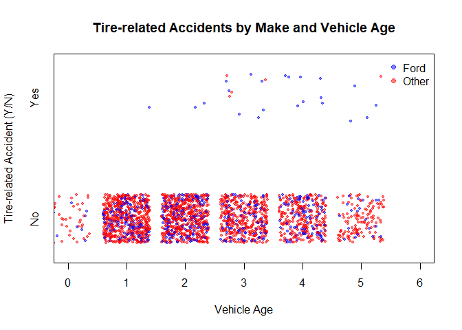
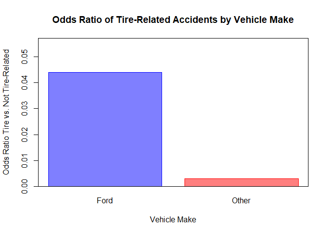
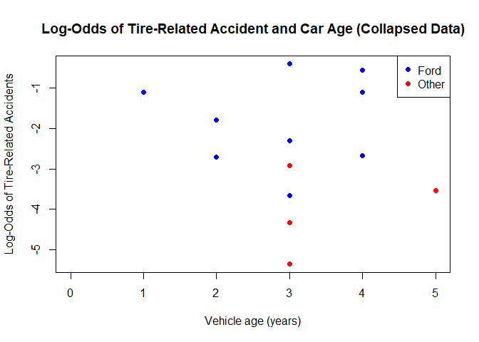
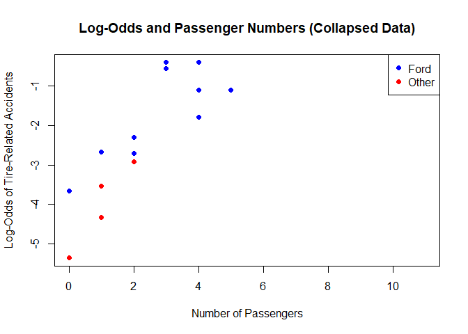
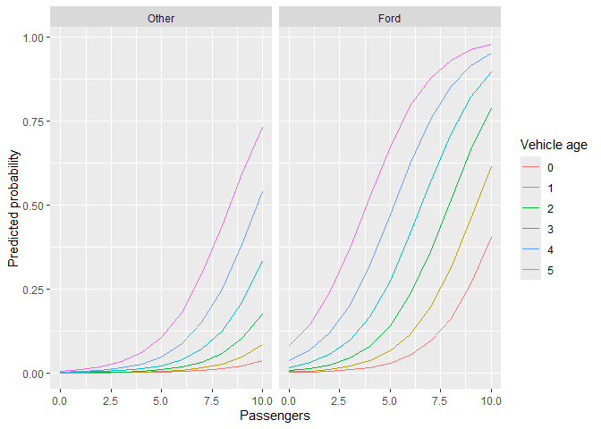

<br>

<div style="text-align: center;">

<h3>

Assessing the Influence of Vehicle Age and Passenger Number on the Odds
of Tire-Related Fatal Accidents in 1995-1999 Ford and Other Sport
Utility Vehicle (SUV) Models
</h3>

</div>

<br>

### Aim

The aim of the study was to examine data on tire-related fatal car
accidents and to uncover whether, among the observed cases, the odds of
such crashes were significantly higher for Ford Explorers compared to
other car makes, after accounting for vehicle age and passenger numbers.
Additionally, the study sought out to test if the number of passengers
and the vehicle’s model year were related to the odds of tire-related
accidents. This was assessed to address concerns that heavy loads or car
age may have contributed to these cases. Finally, the analysis was used
to develop a statistical model predicting the odds of tire-related
accidents based on car make, number of passengers and vehicle age.

<br>

### Background

During the 1990s, the Ford Explorer raised concerns due to the increased
risk of fatal accidents when fitted with particular Firestone tires.
Over 30 lawsuits were filed in relation to this issue. The U.S. federal
crash data showed that the odds for fatal-crashes involving Ford SUVs
were three times higher than for other SUV makes.

<br>

### Statistical Methods and Results

### Variables

All four variables used are described below:

1.  `Make` (predictor categorical variable, two levels): identifies the
    type of sport utility vehicle classified as “Other” and “Ford”.

2.  `VehicleAge` (predictor scaled variable): represents the age of car
    in years.

3.  `Passengers` (predictor scaled variable): indicates the number of
    passengers on board, where 0 signifies that only the driver was in
    the car.

4.  `Cause` (outcome, binary variable): marks if the accident was
    tire-related or caused by other factors.

<br>

### Results

Data were retrieved from the Sleuth3 package in R.

``` r
library(Sleuth3)
head(ex2018)
```

    ##    Make VehicleAge Passengers   Cause
    ## 1 Other          1          0 NotTire
    ## 2 Other          1          0 NotTire
    ## 3 Other          1          0 NotTire
    ## 4 Other          1          0 NotTire
    ## 5 Other          1          0 NotTire
    ## 6 Other          1          3 NotTire

``` r
#Examine data structure 
str(ex2018)
```

    ## 'data.frame':    2321 obs. of  4 variables:
    ##  $ Make      : Factor w/ 2 levels "Ford","Other": 2 2 2 2 2 2 2 2 2 2 ...
    ##  $ VehicleAge: int  1 1 1 1 1 1 1 1 1 1 ...
    ##  $ Passengers: int  0 0 0 0 0 3 0 2 0 2 ...
    ##  $ Cause     : Factor w/ 2 levels "NotTire","Tire": 1 1 1 1 1 1 1 1 1 1 ...

**Step 1.** The data set consisted of four variables: two factors with
two levels each, and two continuous variables. Because the level `Ford`
was set as the default reference, the `Make` variable was reordered to
place `Other` as the reference level, allowing for more parsimonious
analysis interpretation.

``` r
ex2018$Make <- factor(ex2018$Make, levels=c("Other", "Ford"))
str(ex2018)
```

    ## 'data.frame':    2321 obs. of  4 variables:
    ##  $ Make      : Factor w/ 2 levels "Other","Ford": 1 1 1 1 1 1 1 1 1 1 ...
    ##  $ VehicleAge: int  1 1 1 1 1 1 1 1 1 1 ...
    ##  $ Passengers: int  0 0 0 0 0 3 0 2 0 2 ...
    ##  $ Cause     : Factor w/ 2 levels "NotTire","Tire": 1 1 1 1 1 1 1 1 1 1 ...

<br> The variable inspection was followed by plotting the data to check
for potential relationships between the predictors and response
variable.

``` r
#Plot tire-related related accident counts against passenger numbers
plot(jitter(as.numeric(Cause),factor=1) ~ jitter(Passengers,factor=2), 
     data = ex2018, 
     col = ifelse(Make == "Ford",  adjustcolor("blue", alpha.f = 0.5), adjustcolor("red", alpha.f = 0.5)), 
     pch = 20, 
     cex = 0.8, 
     main = "Tire-related Accidents by Make and Passenger Numbers", 
     xlab = "Number of Passengers", 
     ylab = "Tire-related Accident (Y/N)", 
     xlim= c(0,12), 
     ylim = c(0.7, 2.3), 
     axes=FALSE)

axis(side=1)
axis(side=2, 
     at = c(1,2), 
     c("No","Yes"), 
     tick = FALSE)

legend("topright", legend = c("Ford", "Other"),
       col = c(adjustcolor("blue", alpha.f = 0.5), adjustcolor("red", alpha.f = 0.5)), 
       pch = 19, 
       bty = "n")

box()
```

<!-- -->

**Figure 1** *Relationship Between Tire-related and Non-tire Related
Accidents by Car Make and Number of Passengers*

According to the visual inspection of raw data, Ford vehicles appeared
to have more tire-related accidents than other makes. The pattern was
consistent for vehicles carrying up to five passengers.

``` r
#Plot tire-related counts against car age
plot(jitter(as.numeric(Cause),factor=1) ~ jitter(VehicleAge,factor=2), 
     data = ex2018, 
      col = ifelse(Make == "Ford",  adjustcolor("blue", alpha.f = 0.5), adjustcolor("red", alpha.f = 0.5)), 
     pch = 20, 
     cex = 0.8, 
     main = "Tire-related Accidents by Make and Vehicle Age", 
     xlab = "Vehicle Age", 
     ylab = "Tire-related Accident (Y/N)", 
     xlim= c(0,6), 
     ylim = c(0.7, 2.3), 
     axes=FALSE)

axis(side=1)
axis(side=2, 
     at = c(1,2), 
     c("No","Yes"), 
     tick = FALSE)

legend("topright", legend = c("Ford", "Other"),
        col = c(adjustcolor("blue", alpha.f = 0.5), adjustcolor("red", alpha.f = 0.5)), 
       pch = 19, 
       bty = "n")

box()
```

<!-- -->

**Figure 2** *Relationship Between Tire-related and Non-tire Related
Accidents by Car Make and Vehicle Age*

The plot suggested that Ford vehicles tend to have more tire-related
accidents than other makes, especially among older cars. In contrast,
brand-new cars did not appear to have any tire-related accidents.

**Step 2.** After the visual data inspection, a preliminary calculation
of the odds ratio for tire-related accidents between Ford and other car
makes, as well as its 95% confidence interval were calculated. This
analysis was conducted to explore the relationship between car make and
tire-related accidents without adjusting for other predictors. Prior to
the calculation, it was assessed whether the normal approximation was
appropriate for estimating the odds ratio confidence interval.

A contingency table was created to calculate the odds ratio between car
make and the cause of the accident:

``` r
#Make contingency table for simpler interpretation
m <- factor(ex2018$Make, levels=c("Ford", "Other"))
c <- factor(ex2018$Cause, levels=c("Tire", "NotTire"))
tableOdds <- table(m, c)
names(dimnames(tableOdds)) <- c("","")

print(tableOdds)
```

    ##        
    ##         Tire NotTire
    ##   Ford    22     500
    ##   Other    5    1794

The appropriateness for using normal approximation was assessed:

``` r
#Cell counts and proportions for Ford make
pi1 <- 22/522
n1 <- 522
one_minus_pi1 <- (1-(22/522))
pi1*n1
```

    ## [1] 22

``` r
one_minus_pi1*n1
```

    ## [1] 500

``` r
#Cell counts proportions for Other makes
pi2 <- 5/1799
n2 <- 1799
one_minus_pi2 <- (1-(5/1799))
pi2*n2
```

    ## [1] 5

``` r
one_minus_pi2*n2
```

    ## [1] 1794

All cells counts were equal to or over five, therefore, the dataset met
the assumption required for normal approximation.

**Step 3.** This was followed by calculating the odds ratio and its 95%
CI using Fisher’s exact test. In particular:  
H0: The odds ratio between Ford and other vehicles for tire-related
fatal accidents is equal to 1.  
H1: The odds ratio between Ford and other vehicles for tire-related
fatal accidents is not equal 1.

``` r
fisher.test(tableOdds)
```

    ## 
    ##  Fisher's Exact Test for Count Data
    ## 
    ## data:  tableOdds
    ## p-value = 9.842e-11
    ## alternative hypothesis: true odds ratio is not equal to 1
    ## 95 percent confidence interval:
    ##   5.785418 53.567025
    ## sample estimates:
    ## odds ratio 
    ##    15.7628

The difference in odds for tire-related accidents between Ford and other
car makes was significant (p \< .001), and was 15.76 times higher for
Ford than other vehicle makes. The true odds ratio for Ford tire-related
accidents was estimated to lie between 5.78 and 53.57. The odds for
tire-related crashes was illustrated below:

``` r
#Compute the odds of tire-related fatal accidents by vehicle make 
odds <- round(tableOdds[,"Tire"]/ tableOdds[,"NotTire"], 3)
print(odds)
```

    ##  Ford Other 
    ## 0.044 0.003

``` r
#Plot the odds of tire-related fatal accidents by vehicle make 
bp <- barplot(odds,
              ylim = c(0, max(odds)*1.3),
              col = c(rgb(0, 0, 1, 0.5), rgb(1, 0, 0, 0.5)),
              border = c("blue", "red"),
              main = "Odds Ratio of Tire-Related Accidents by Vehicle Make",
              ylab = "Odds Ratio Tire vs. Not Tire-Related",
              xlab = "Vehicle Make")
box()
```

<!-- -->

**Figure 3** *Relationship Between the Odds of Tire-related Accidents by
Car Make*

The visual representation of the odds for Ford tire-related accidents
supported the odds ratio test, showing that the odds were visibly higher
compared to other makes.

**Step 4.** The dataset was collapsed into grouped counts of
tire-related (success) and non tire-related (failure) accidents for each
combination of car make, vehicle age, and number of passengers. Because
the response variable was in binomial form, it was suitable to explore
the relationships between variables using a logistic regression model.
The first logistic regression included all three potential predictors:
make, age of vehicle and passenger numbers, which were fitted into an
additive model.

``` r
# Number of accidents due to tires (success) or not due to tire (failure)
y_success <- aggregate(Cause == "Tire" ~ Make + VehicleAge + Passengers, data = ex2018, sum)
y_failure <- aggregate(Cause == "NotTire" ~ Make + VehicleAge + Passengers, data = ex2018, sum)

# Merge the two summaries
collapsed_data <- merge(y_success, y_failure, by = c("Make", "VehicleAge", "Passengers"))
names(collapsed_data)[4:5] <- c("y_success", "y_failure")

# Rename columns for clarity
names(collapsed_data)[4:5] <- c("y_success", "y_failure")
str(collapsed_data)
```

    ## 'data.frame':    79 obs. of  5 variables:
    ##  $ Make      : Factor w/ 2 levels "Other","Ford": 2 2 2 2 2 2 2 2 2 2 ...
    ##  $ VehicleAge: int  0 0 0 0 1 1 1 1 1 1 ...
    ##  $ Passengers: int  0 1 2 3 0 1 2 3 4 5 ...
    ##  $ y_success : int  0 0 0 0 0 0 0 0 0 1 ...
    ##  $ y_failure : int  5 3 1 1 63 42 22 12 3 3 ...

``` r
# Check structure
str(collapsed_data)
```

    ## 'data.frame':    79 obs. of  5 variables:
    ##  $ Make      : Factor w/ 2 levels "Other","Ford": 2 2 2 2 2 2 2 2 2 2 ...
    ##  $ VehicleAge: int  0 0 0 0 1 1 1 1 1 1 ...
    ##  $ Passengers: int  0 1 2 3 0 1 2 3 4 5 ...
    ##  $ y_success : int  0 0 0 0 0 0 0 0 0 1 ...
    ##  $ y_failure : int  5 3 1 1 63 42 22 12 3 3 ...

``` r
head(collapsed_data)
```

    ##   Make VehicleAge Passengers y_success y_failure
    ## 1 Ford          0          0         0         5
    ## 2 Ford          0          1         0         3
    ## 3 Ford          0          2         0         1
    ## 4 Ford          0          3         0         1
    ## 5 Ford          1          0         0        63
    ## 6 Ford          1          1         0        42

After data collapse a data inspection was preformed to check if any log
transformations were needed.

``` r
# Compute probabilities, odds, and log-odds
collapsed_data$prob <- collapsed_data$y_success / (collapsed_data$y_success + collapsed_data$y_failure)
collapsed_data$odds <- collapsed_data$prob / (1 - collapsed_data$prob)
collapsed_data$logodds <- log(collapsed_data$odds)

# Plot log-odds vs `VehicleAge`, by Make
plot(logodds ~ VehicleAge, data = collapsed_data, 
     col = ifelse(Make == "Ford", "blue", "red"),
     pch = 19,
     xlab = "Vehicle age (years)", 
     ylab = "Log-Odds of Tire-Related Accidents",
     main = "Log-Odds of Tire-Related Accident and Car Age (Collapsed Data)")

legend("topright", legend = c("Ford", "Other"), col = c("blue", "red"), pch = 19)
```

<!-- -->

**Figure 4** *Relationship Between Log-Odds of Tire-Related Accident and
Car Age*

``` r
# Compute probabilities, odds, and log-odds (if not already done)
collapsed_data$prob <- collapsed_data$y_success / (collapsed_data$y_success + collapsed_data$y_failure)
collapsed_data$odds <- collapsed_data$prob / (1 - collapsed_data$prob)
collapsed_data$logodds <- log(collapsed_data$odds)

# Plot log-odds vs Number of Passengers, by Make
plot(logodds ~ Passengers, data = collapsed_data, 
     col = ifelse(Make == "Ford", "blue", "red"),
     pch = 19,
     xlab = "Number of Passengers", 
     ylab = "Log-Odds of Tire-Related Accidents",
     main = "Log-Odds and Passenger Numbers (Collapsed Data)")

legend("topright", legend = c("Ford", "Other"), col = c("blue", "red"), pch = 19)
```

<!-- -->

**Figure 5** *Relationship Between Log-Odds of Tire-Related Accident and
Passenger Number*

The log-odds seemed to increase linearly with both predictors,
suggesting that the assumption of linearity in the log-odds was
accepted. Therefore, no variable transformations were performed.

**Step 5.** The data inspection was followed by a logistic regression
analysis.

``` r
# Fit logistic regression using grouped data
fit <- glm(cbind(y_success, y_failure) ~ Make + VehicleAge + Passengers,
           data = collapsed_data, family = binomial)

#Inspect coefficients 
summary(fit)
```

    ## 
    ## Call:
    ## glm(formula = cbind(y_success, y_failure) ~ Make + VehicleAge + 
    ##     Passengers, family = binomial, data = collapsed_data)
    ## 
    ## Coefficients:
    ##             Estimate Std. Error z value Pr(>|z|)    
    ## (Intercept)  -9.5227     0.8887 -10.715  < 2e-16 ***
    ## MakeFord      2.8614     0.5189   5.515 3.49e-08 ***
    ## VehicleAge    0.8499     0.1784   4.765 1.89e-06 ***
    ## Passengers    0.6277     0.1042   6.025 1.69e-09 ***
    ## ---
    ## Signif. codes:  0 '***' 0.001 '**' 0.01 '*' 0.05 '.' 0.1 ' ' 1
    ## 
    ## (Dispersion parameter for binomial family taken to be 1)
    ## 
    ##     Null deviance: 164.957  on 78  degrees of freedom
    ## Residual deviance:  66.366  on 75  degrees of freedom
    ## AIC: 103.62
    ## 
    ## Number of Fisher Scoring iterations: 6

``` r
#Exponentiate values to convert log-odds to odds 
exp(2.8614) 
```

    ## [1] 17.48599

``` r
exp(0.8499)
```

    ## [1] 2.339413

``` r
exp(0.6277)
```

    ## [1] 1.873297

According to the fitted model, all predictors of the log-odds of
tire-related accidents were significant. To make interpretation easier,
the model coefficients were exponentiated.The results suggested the
following:

- The coefficient for `MakeFord` was β = 2.86 (p \< .001), which
  indicated that driving a Ford multiplied the odds of a tire-related
  accident by 17.48 compared to driving other makes, while holding
  `VehicleAge` and `Passengers` constant.

- An increase in `VehicleAge` by 1 year increased the odds of
  tire-related accident by a factor of 2.34, while holding the `Make`
  and `Passengers` constant (β = 0.85, p \< .001).

- Each additional person increased the odds of tire-related accidents by
  a factor of 1.87, while holding the `Make` and `VehicleAge` constant
  (β = 0.63, p \< .001).

These findings were used to propose the Model_1:

<br>

<div style="text-align: center;">

log(P(Tire)/P(NotTire))= β0 + β1(`Make`) + β2(`VehicleAge`) +
β3(`Passengers`)

</div>

<br>

**Step 6.** The residual deviance was slightly smaller than the degrees
of freedom, which can indicate that the model fit the data well. A
deviance goodness-of-fit was performed to confirm this observation:

``` r
#Access residual deviance for Model_1
residual.deviance <- summary(fit)$deviance
residual.deviance
```

    ## [1] 66.36589

``` r
#Access degrees of freedom for Model_1
deg.of.freedom <- summary(fit)$df.residual 
deg.of.freedom
```

    ## [1] 75

``` r
#Preform the deviance goodness-of-fit test
1 - pchisq(residual.deviance, deg.of.freedom )
```

    ## [1] 0.7514288

The test indicated that the residual deviance was not significantly
different (p = 0.75) what would be expected under a Chi-squared
distribution with 75 degrees of freedom. This suggested that the model
fit the data well and it was appropriate to proceed with the analysis.

**Step 7.** To check if interactions between the predictors influenced
the odds of tire-related accidents, an interaction model was fitted
(Model_2) which included all two-way interactions.

``` r
fit.int <- glm(cbind(y_success, y_failure) ~ Make * VehicleAge * Passengers, data   = collapsed_data, family = binomial)
summary(fit.int)
```

    ## 
    ## Call:
    ## glm(formula = cbind(y_success, y_failure) ~ Make * VehicleAge * 
    ##     Passengers, family = binomial, data = collapsed_data)
    ## 
    ## Coefficients:
    ##                                Estimate Std. Error z value Pr(>|z|)    
    ## (Intercept)                    -7.76267    1.62885  -4.766 1.88e-06 ***
    ## MakeFord                        1.36640    2.04486   0.668    0.504    
    ## VehicleAge                      0.58588    0.45203   1.296    0.195    
    ## Passengers                      0.15177    0.79839   0.190    0.849    
    ## MakeFord:VehicleAge             0.05611    0.57967   0.097    0.923    
    ## MakeFord:Passengers             0.29778    0.87078   0.342    0.732    
    ## VehicleAge:Passengers           0.01094    0.23129   0.047    0.962    
    ## MakeFord:VehicleAge:Passengers  0.10161    0.25647   0.396    0.692    
    ## ---
    ## Signif. codes:  0 '***' 0.001 '**' 0.01 '*' 0.05 '.' 0.1 ' ' 1
    ## 
    ## (Dispersion parameter for binomial family taken to be 1)
    ## 
    ##     Null deviance: 164.957  on 78  degrees of freedom
    ## Residual deviance:  60.376  on 71  degrees of freedom
    ## AIC: 105.63
    ## 
    ## Number of Fisher Scoring iterations: 7

An automatic stepwise selection followed to detect significant
predictors and develop the simplest version of Model_2:

``` r
#Find best model 
fit.int.step<- step(fit.int, test="Chisq")
```

    ## Start:  AIC=105.63
    ## cbind(y_success, y_failure) ~ Make * VehicleAge * Passengers
    ## 
    ##                              Df Deviance    AIC     LRT Pr(>Chi)
    ## - Make:VehicleAge:Passengers  1   60.527 103.78 0.15152   0.6971
    ## <none>                            60.376 105.63                 
    ## 
    ## Step:  AIC=103.78
    ## cbind(y_success, y_failure) ~ Make + VehicleAge + Passengers + 
    ##     Make:VehicleAge + Make:Passengers + VehicleAge:Passengers
    ## 
    ##                         Df Deviance    AIC    LRT Pr(>Chi)  
    ## - Make:VehicleAge        1   60.742 102.00 0.2153   0.6426  
    ## - VehicleAge:Passengers  1   61.463 102.72 0.9355   0.3334  
    ## <none>                       60.527 103.78                  
    ## - Make:Passengers        1   65.231 106.48 4.7036   0.0301 *
    ## ---
    ## Signif. codes:  0 '***' 0.001 '**' 0.01 '*' 0.05 '.' 0.1 ' ' 1
    ## 
    ## Step:  AIC=102
    ## cbind(y_success, y_failure) ~ Make + VehicleAge + Passengers + 
    ##     Make:Passengers + VehicleAge:Passengers
    ## 
    ##                         Df Deviance    AIC    LRT Pr(>Chi)  
    ## - VehicleAge:Passengers  1   62.176 101.43 1.4334  0.23122  
    ## <none>                       60.742 102.00                  
    ## - Make:Passengers        1   65.474 104.73 4.7316  0.02961 *
    ## ---
    ## Signif. codes:  0 '***' 0.001 '**' 0.01 '*' 0.05 '.' 0.1 ' ' 1
    ## 
    ## Step:  AIC=101.43
    ## cbind(y_success, y_failure) ~ Make + VehicleAge + Passengers + 
    ##     Make:Passengers
    ## 
    ##                   Df Deviance    AIC     LRT  Pr(>Chi)    
    ## <none>                 62.176 101.43                      
    ## - Make:Passengers  1   66.366 103.62  4.1902   0.04066 *  
    ## - VehicleAge       1   89.013 126.27 26.8374 2.213e-07 ***
    ## ---
    ## Signif. codes:  0 '***' 0.001 '**' 0.01 '*' 0.05 '.' 0.1 ' ' 1

The stepwise process indicated that the `Make:Passengers` interaction
was significant (p \< 0.05). An ANOVA comparison and summary check were
computed to assess the value of adding this interaction to the model.

The ANOVA comparison (Likelihood Ratio Test) suggested that including
the `Make` and `Passengers` interaction significantly improved the model
fit compared to Model_1. However, this effect was not supported by the
summary() output (β = 0.57, p = 0.08), as shown below:

``` r
#Ask for Likelihood Ratio Test
anova(fit, fit.int.step,test="Chisq")
```

    ## Analysis of Deviance Table
    ## 
    ## Model 1: cbind(y_success, y_failure) ~ Make + VehicleAge + Passengers
    ## Model 2: cbind(y_success, y_failure) ~ Make + VehicleAge + Passengers + 
    ##     Make:Passengers
    ##   Resid. Df Resid. Dev Df Deviance Pr(>Chi)  
    ## 1        75     66.366                       
    ## 2        74     62.176  1   4.1902  0.04066 *
    ## ---
    ## Signif. codes:  0 '***' 0.001 '**' 0.01 '*' 0.05 '.' 0.1 ' ' 1

However the summary() inspection of fit.int.step showed that the
evidence for an Make:Passengers was weak β = 0.57 (p \< .09):

``` r
#Ask for model summary 
summary(fit.int.step)
```

    ## 
    ## Call:
    ## glm(formula = cbind(y_success, y_failure) ~ Make + VehicleAge + 
    ##     Passengers + Make:Passengers, family = binomial, data = collapsed_data)
    ## 
    ## Coefficients:
    ##                     Estimate Std. Error z value Pr(>|z|)    
    ## (Intercept)          -8.7653     0.9053  -9.682  < 2e-16 ***
    ## MakeFord              1.7316     0.7069   2.450   0.0143 *  
    ## VehicleAge            0.8614     0.1818   4.738 2.16e-06 ***
    ## Passengers            0.1992     0.3010   0.662   0.5081    
    ## MakeFord:Passengers   0.5690     0.3290   1.730   0.0837 .  
    ## ---
    ## Signif. codes:  0 '***' 0.001 '**' 0.01 '*' 0.05 '.' 0.1 ' ' 1
    ## 
    ## (Dispersion parameter for binomial family taken to be 1)
    ## 
    ##     Null deviance: 164.957  on 78  degrees of freedom
    ## Residual deviance:  62.176  on 74  degrees of freedom
    ## AIC: 101.43
    ## 
    ## Number of Fisher Scoring iterations: 7

``` r
#Convert interaction coefficient from log-odds to odds 
exp(0.5690)
```

    ## [1] 1.7665

The summary results suggested that for Ford vehicles (β = 0.57, p \>
.05), an increase in the number of passengers multiplied the odds of a
tire-related accident by 1.77, compared to the effect of an additional
in passenger in other makes, while holding `VehicleAge` constant.
However, this observation should be taken with caution, as there was
inconsistent evidence to support this claim (β = 0.57, p \< .09).

Even though the Likelihood Ratio Test is generally considered more
reliable and indicated that adding the `MakeFord:Passengers` interaction
improved the model overall, the `summary()` output was used to help
model selection, thus, Model_1 was retained.

**Step 8.** Furthermore, confidence intervals were calculated to
estimate the possible range of coefficient values for `Make`,
`VehicleAge` and `Passengers`, and to assess their multiplicative
effects on the odds of tire-related accidents.

``` r
#Calculate and exponentiate CIs for Model_1 coefficients
exp(confint(fit))
```

    ## Waiting for profiling to be done...

    ##                    2.5 %       97.5 %
    ## (Intercept) 1.080952e-05 3.597715e-04
    ## MakeFord    6.835387e+00 5.439448e+01
    ## VehicleAge  1.674010e+00 3.386422e+00
    ## Passengers  1.526284e+00 2.307320e+00

According to the output:

- The odds of a tire-related accident were multiplied by a factor
  between 6.83 and 54.39 for Ford vehicles compared to other makes,
  holding `VehicleAge` age and `Passengers`constant.

- For each one year increase in car age, the odds of a tire-related
  accident were multiplied by a factor between 1.67 and 3.39,holding
  `Make` and `Passengers` constant.

- For each additional passenger, the odds of a tire-related accident
  were multiplied by a factor between 1.53 and 2.31, holding `Make` and
  car `VehicleAge` constant.

These results provided evidence for the research question. They
indicated that the odds of tire-related accidents were higher for Ford
vehicles compared to other makes. Also, the findings showed that an
increase in number of passengers and vehicle age were associated with
higher odds of tire-related accidents for Fords. The logistic regression
odds ratio for Ford vehicles was larger than that obtained in the
preliminary odds ratio calculation (Step 3). This observation was the
same for the preliminary and `confint()` CI outputs.

Below is a snapshot on how well the model predicted the outcomes in the
ex2018 dataset:

``` r
pred.response <- predict(fit, newdata= ex2018, type = "response")
pred.response <- round(predict(fit, newdata = ex2018, type = "response"), 5)
head(data.frame(prediction=pred.response, status=ex2018$Cause),3)
```

    ##   prediction  status
    ## 1    0.00017 NotTire
    ## 2    0.00017 NotTire
    ## 3    0.00017 NotTire

``` r
table(ex2018$Cause, pred.response > 0.5)
```

    ##          
    ##           FALSE TRUE
    ##   NotTire  2290    4
    ##   Tire       24    3

``` r
test <- round(2293/2321, 3)
test
```

    ## [1] 0.988

The model correctly predicted 2,293 out of 2,321 outcomes from the raw
dataset, which means that it had the capacity to predict 98.8% of the
outcomes correctly.

**Step 9.** After the check, a table was created using the fitted model
(estimated on collapsed binomial data) to calculate predicted
probabilities for each combination of `VehicleAge`, `Passengers` and
`Make`.These predictions were used to create a graph that showed how the
probability of tire-related accidents varied across all predictors for
both car makes (Figure 6).

``` r
#Calculate predicted probabilities for each combination of `VehicleAge`, `Passengers` and `Make`
passengers <- seq(0,10,1)
ages <- seq(0, 5, length.out = 200)

makes <- c("Other", "Ford")
grid <- expand.grid(Passengers=passengers, VehicleAge=ages, Make=makes)
grid$predicted <- round(predict(fit, newdata = grid, type = "response"), 5)
grid <- grid[,c("Make", "VehicleAge", "Passengers", "predicted")]

head(grid)
```

    ##    Make VehicleAge Passengers predicted
    ## 1 Other          0          0   0.00007
    ## 2 Other          0          1   0.00014
    ## 3 Other          0          2   0.00026
    ## 4 Other          0          3   0.00048
    ## 5 Other          0          4   0.00090
    ## 6 Other          0          5   0.00169

``` r
grid[3000,]
```

    ##      Make VehicleAge Passengers predicted
    ## 3000 Ford   1.809045          7   0.32525

For instance, for a Ford that was about 1.8 years old and carried seven
passengers, the model estimated a 32.5% probability of a tire-related
fatal accident, holding everything else constant. Below is an
illustration of the predicted probabilities for both vehicle makes
across different ages and passenger numbers, based in dataset from Step
9.

``` r
# 1) Build a small, simple grid
passengers <- 0:10
ages <- 0:5                       # keep ages discrete so you get a few lines
makes <- c("Other","Ford")

grid <- expand.grid(Passengers = passengers,
                    VehicleAge = ages,
                    Make = makes)

grid$predicted <- predict(fit, newdata = grid, type = "response")

# 2) Minimal ggplot: colour by age, facet by make
library(ggplot2)
ggplot(grid, aes(x = Passengers, y = predicted,
                 colour = factor(VehicleAge), group = VehicleAge)) +
  geom_line() +
  facet_grid(~ Make) +
  labs(y = "Predicted probability", colour = "Vehicle age")
```

<!-- -->
\`\`\`

**Figure 6** *Relationship Between Predicted Probabilities for Both
Makes Across Different Ages and Passenger Numbers*

<br>

### Findings

The analysis showed that Ford SUVs manufactured between 1995 and 1999
consistently had a higher probability of being involved in tire-related
accidents than other car makes (Figure 6). In the Figure 6, the blue
line represents Ford vehicles, while the red like shows other makes. The
graph suggests that the probability of tire-related accidents increased
with both vehicle age and the number of passengers in the car.

The analysis led to the development of a logistic regression model that
estimates the odds or probability of tire-related accidents for Ford
vehicles (Step 5): <br>

<div style="text-align: center;">

log(P(Tire)/P(NotTire))= β0 + β1(Make) + β2(VehicleAge) + β3(Passengers)

</div>

<br> The lower odds for Ford tire-related crashes in the preliminary
Fisher’s test (Step 3) in comparison to the logistic regression output
(Step 5), highlight the influence of car load and age on the risk of
fatal car crashes. However, the logistic regression did not show
significant effects of age and passenger number on tire-related
accidents between Ford and other car makes.

The proposed formula provides numerical answers to the research aim. For
instance, according this model, if a Ford is 1.8 years old and carries
passengers, there is a 32.5% probability of a tire-related accident
compared to other car make tire-related crashes.

<br>

### Discussion

The aim of the study was to investigate whether tire-related accidents
were more likely to involve Ford Explorers than other SUVs, and if the
number of passenger and vehicle age had an influence on the odds of
tire-related crashes.

The results of the study supported both predictions. In particular, the
analysis suggested that the odds for Ford vehicles were about 17 times
higher than other SUVs, even after controlling for the effects of car
age and number of passengers. Furthermore, the findings showed that each
extra year in car age more than doubled the odds of a tire-related
accident, while each additional passenger nearly doubled the odds.
Simply put, heavier loads and older cars, increased the odds for Ford
tire-related crashes compared to other makes.

The study had several limitations. The dataset lacked other variables
that could provide more insight into the Ford tire-related accidents
such as driving conditions. This was an observational study; therefore,
causal conclusions are not advised. Lastly, because the observed
vehicles were from the 1990s, any generalisations apply only to those
particular models. It is suggested that future studies could include
more explanatory variables and focus on modern vehicles.

<br>

#### References

Ramsey, F.L. and Schafer, D.W. (2013). *The statistical sleuth: A course
in methods of data analysis* (3rd ed), Cengage Learning.

<br> <br>
